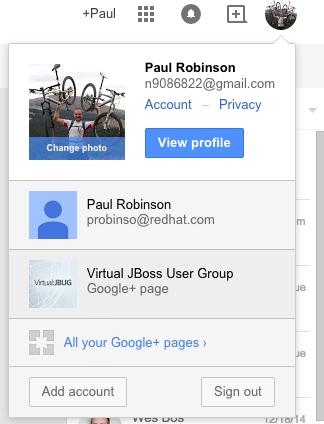
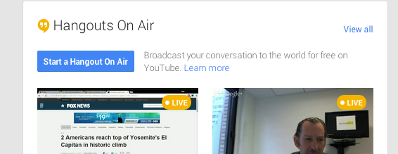
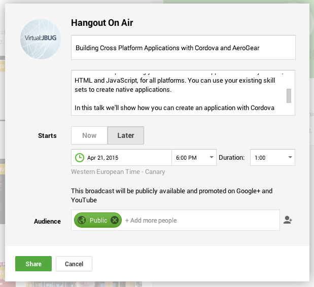
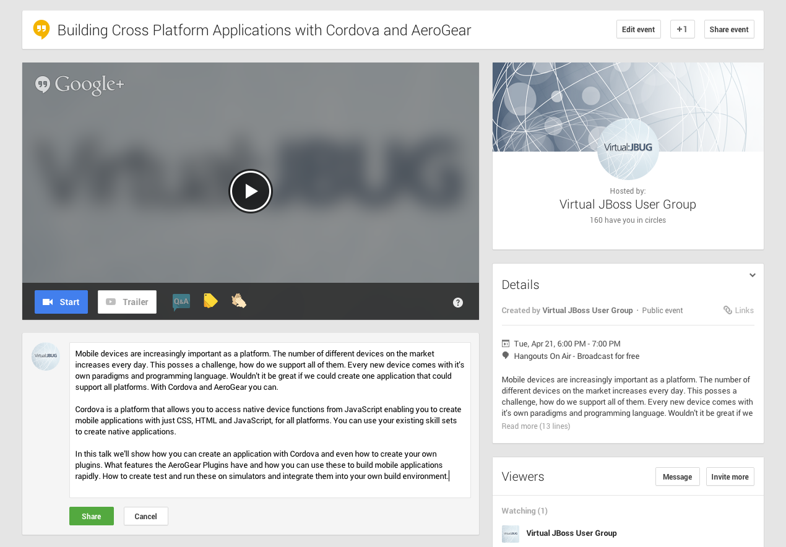
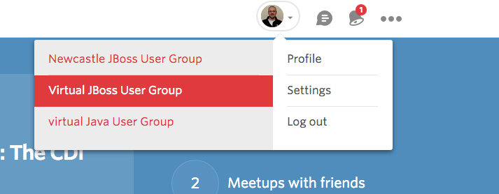
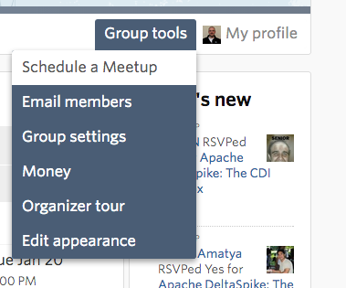
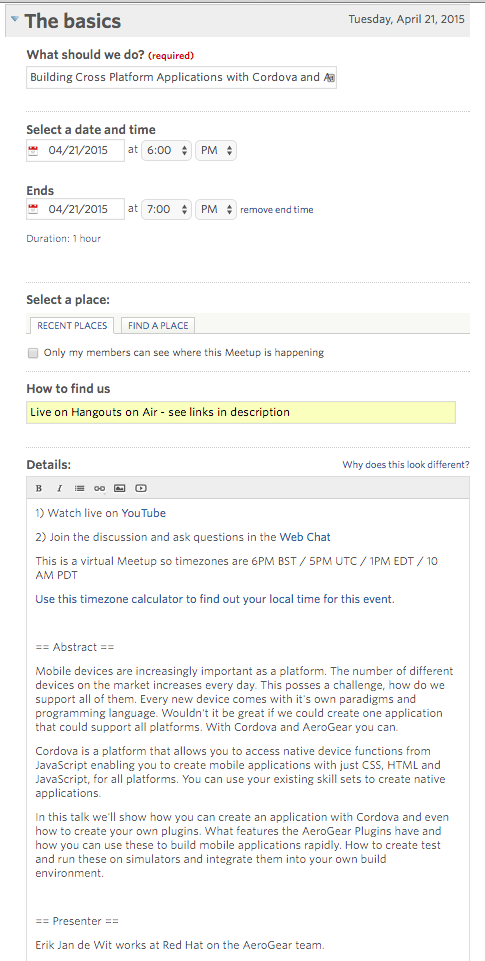

= Instructions for Hosting an Event

1. Open the https://docs.google.com/spreadsheets/d/1NMnQjmzPPgikNHAqjoY8qzn1mFJ_WYkoUqyF9dMYUxg/edit#gid=0[schedule spreadsheet]
2. Identify the row that relates to the event you want to schedule.
3. Work your way across, from left to right, completing the required tasks, and updating the status when it's done. An 'x' means it is done. An 'NA' means that it's not appropriate for this event, so not done.

See bellow for details on how to fulfill each step.

== Google Plus Event

Visit: https://plus.google.com/

Switch to the `vJBUG` account using the account widget on the top-right.

image::./images/2.png[]

Hover over the `Google+ Page` button in the top left and select "Hangouts" from the menu that appears.

Click on `Start hangout on Air`.

Fill in the event details, making sure to select `later`. Pay close attention to the timezone!

A new event page is created. Notice that the abstract is hidden away on the right-hand side.
Add it again as a comment to make it more visible.

Take not of the URL for this event page. You will need it later.

== Meetup Event

Visit http://www.meetup.com

Select the `Virtual JBoss User Group` from the meetups list at the top.

Click on `Group Tools` -> `Schedule an event`

Fill out the details for the event. Note:

* The time has to be in UK time. That's UTC (GMT) in the autumn/winter but UTC+1 (BST) in the spring/summer
* The YouTube link should go to the YouTube event page you created earlier.
* The timezone calculator link can be modified, based on an example taken from a previous meetup event.
* Take care to use the appropriate timezone examples, based on whether daylight saving is in-force during the event. (e.g PDT vs PST).
* Ideally get a decent bio from the presenter. One that is better than in this example would be good.

Click to create the event. Don't announce it yet! That should be done shortly after the preceding event finishes.

== www.jboss.org event
Follow thttps://github.com/jboss-developer/www.jboss.org/blob/master/CONTRIBUTING.md#how-to-add-an-event[these instructions].
Remember to tick the box for "On Homepage".
Also link to the Meetup event for the 'more details link'.

== Anouncement
Typically after the previous event is complete, or two weeks before this event (whichever comes first), visit the event's meetup page and click on "Announce Event".

